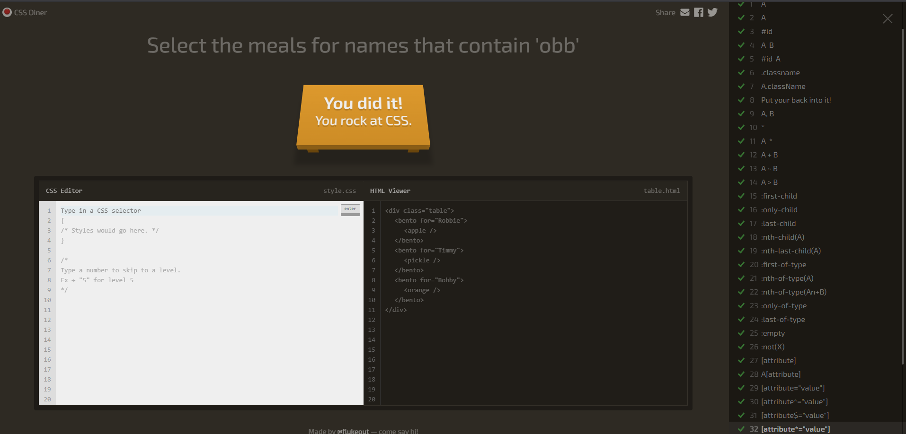

# Ejercitación 7 - Juego para utilizar selectores CSS

**Consigna:** completar el juego para practicar sobre selectores en [flukeout.github.io](http://flukeout.github.io/)

Este ejercicio consiste en resolver los niveles del juego interactivo **CSS Diner**, que va presentando distintos "platos" (elementos HTML) y pide escribir el selector CSS correcto para "seleccionarlos" (resaltarlos), practicando de forma progresiva:

- Selectores básicos: por tipo, por clase, por id, universal.
- Selectores agrupados y combinados.
- Combinadores: descendiente, hijo directo (`>`), hermano adyacente (`+`), hermano general (`~`).
- Selectores de atributo (`[attr]`, `[attr="valor"]`).
- Pseudo-clases: `:first-child`, `:last-child`, `:nth-child()`, `:only-child`, `:not()`, etc.

## Captura del juego completado

